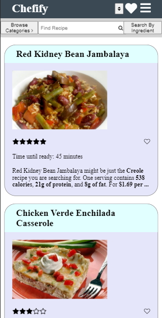
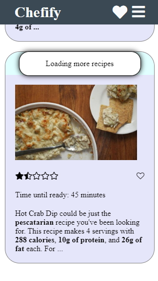
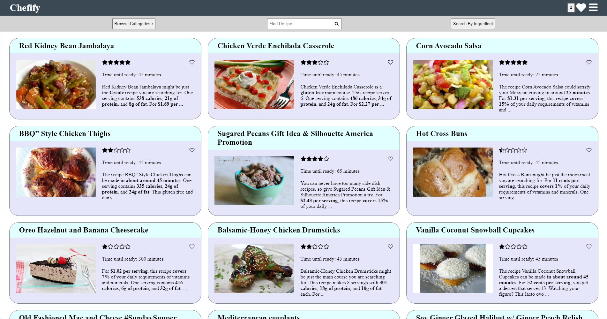
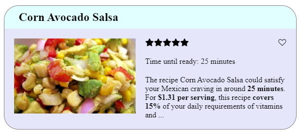
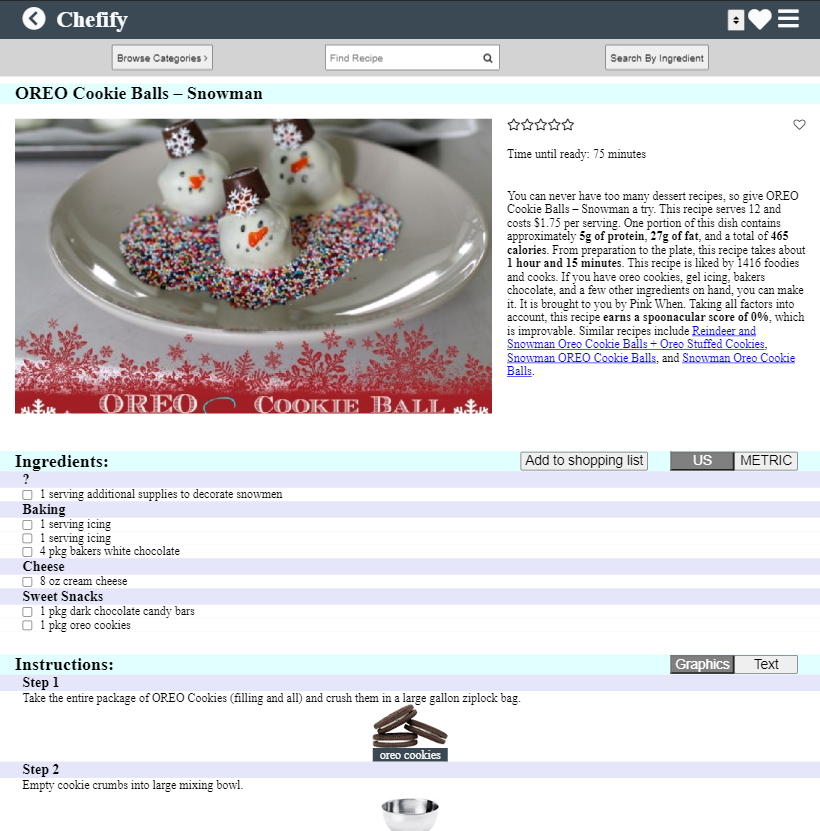
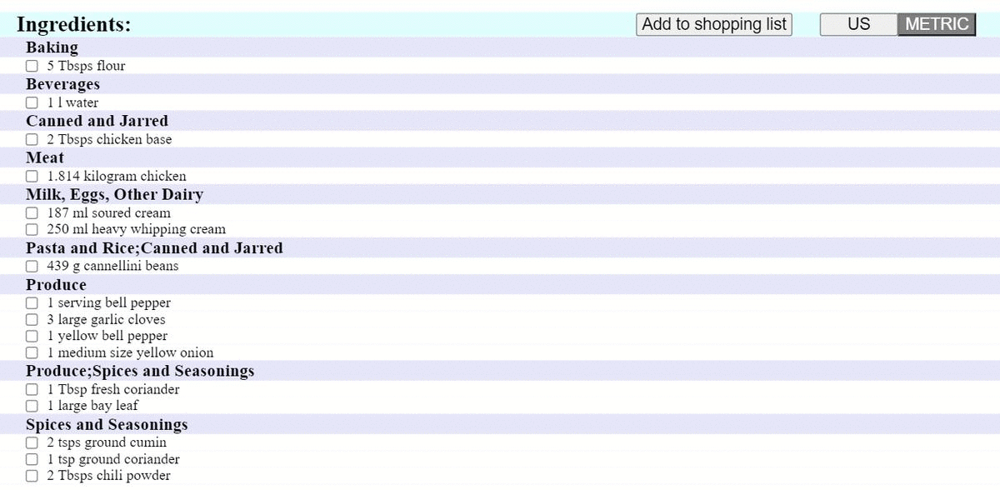
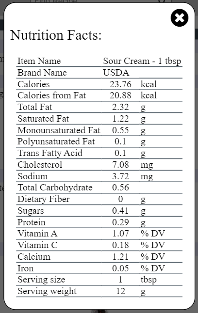
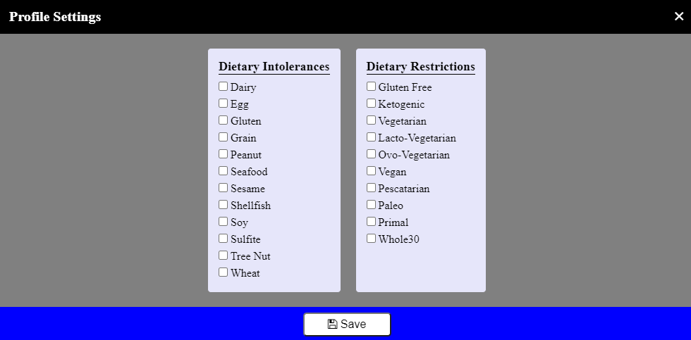
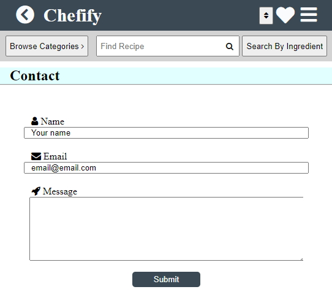
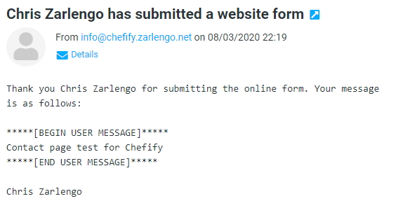

# [Chefify - https://zarlengo.github.io/Project_1/](https://zarlengo.github.io/Project_1/)

Project Description: A mobile first website to search for meal ideas for a user

## Versions
### Mobile Version

* Screen is reactive depending on windows size, recipes and navbar collapse accordingly

* Reaching the bottom of the screen will load additional recipes

### Desktop Version

* Larger screens allows more information to be shown

## Recipes
### Recipe Card

* Recipe name
* Rating out of 5 starts (hover shows a decimal value)
* Favorite icon - allows saving the recipe for easy access later
* Time required to make the meal
* Truncated recipe summary

### Recipe Detail

* Same information as the recipe card
* Full summary description
* Ingredient list
  * Allows selecting specific items to add to a shopping list
  * Adding without selecting any items will add the whole list to the shopping list
  * Clicking the metric / US buttons will change the units shown and what is added to the shopping list

* Two options for displaying the instructions
* Text instructions
  * Plain text version (might be in HTML if uploaded as such) for simpler reading
  * Graphical version includes ingredient pictures and equipment pictures. Clicking on an ingredient pulls up nutrition information for that item.

* Nutrition information for that ingredient
* Values are based by a single serving size, this is not adjusted based on the recipe usage
  
### Favorites

* List of recipes for quick reference for the user
* Clicking on a solid heart will remove the recipe from the favorites
* List is saved locally and will persist through multiple sessions, does not transfer between devices

### Sorting

* Sorts recipes by rating from high to low

## Shopping
### Shopping List

* Ingredient list sorted by grocery aisle to allow ease while shopping.
* Units are in the format entered from the recipe
* Duplicate items are added together when adding additional quantities (different units will not combine together).
* Selecting specific items and clicking remove will delete those items. Clicking remove with nothing will clear the shopping list
  
## Settings 

* Saves user preferences for dietary intolerances and dietary restrictions
* Functionality was not incorporated to automatically only show recipes that meet these criteria
* Saves locally, persists through sessions

## Contact

* User form to allow users to provide feedback to the developers
* Sends a confirmation email to the user upon success. Checks that fields are correctly filled out

## Searching
### Browse by Categories

* Allows users to search recipies by category
* Categories include: Meal types (Lunch, Dinner, ...); Cuisines (Greek, Thai, ...); Diets (Vegan, Paleo, ...); and Other (Low Carbs, High Protein, ...)

### Quick search

* Wildcard search for recipes based on the input
* Searches for recipe titles which include the word provided

### Search by ingredient

* Allows searching by Keyword (titles include this word)
* Can search for recipes which include specific ingredients (ingredient list includes)
* Can search for recipes without ingredients (ingredient list must not include)

  ## API's
* https://spoonacular.com/food-api
* https://www.nutritionix.com/business/api
