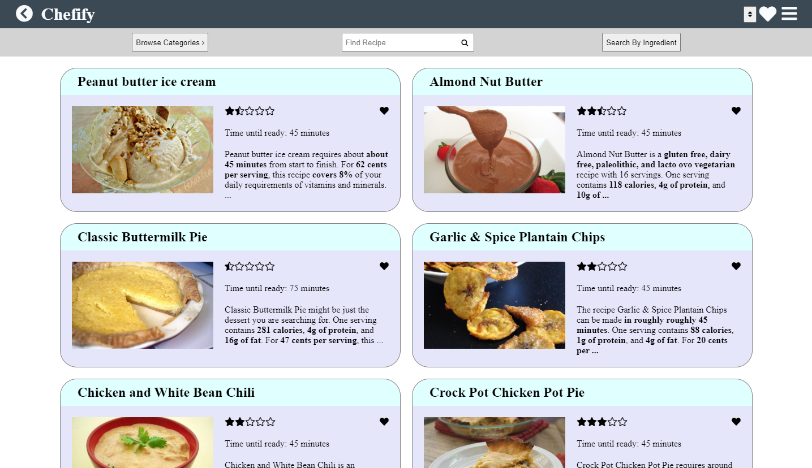
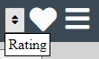
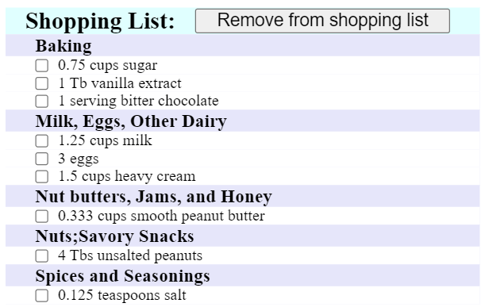

# [Chefify - https://chefify.zarlengo.net/](https://chefify.zarlengo.net/)

Project Description: Mobile first app to create meals for a user and include shopping lists for ingredients

## Project Ideas

* Create recipies / meals
* Create shopping list from recipie(s)
* Link shopping list to purchase through instaCart API
  * List of ingredients
* Search for recipies based on current ingredients in the home (limit searches to include only)
  
### Favorites

* List of recipes for quick reference for the user
* Clicking on a solid heart will remove the recipe from the favorites
* List is saved locally and will persist through multiple sessions, does not transfer between devices

### Sorting

* Sorts recipes by rating from high to low

## Shopping
### Shopping List

* Ingredient list sorted by grocery aisle to allow ease while shopping.
* Units are in the format entered from the recipe
* Duplicate items are added together when adding additional quantities (different units will not combine together).
* Selecting specific items and clicking remove will delete those items. Clicking remove with nothing will clear the shopping list
  
  API's
  * https://spoonacular.com/food-api
  * https://rapidapi.com/spoonacular/api/recipe-food-nutrition
  * https://developers.shop.com/externalapis/apn-services/
